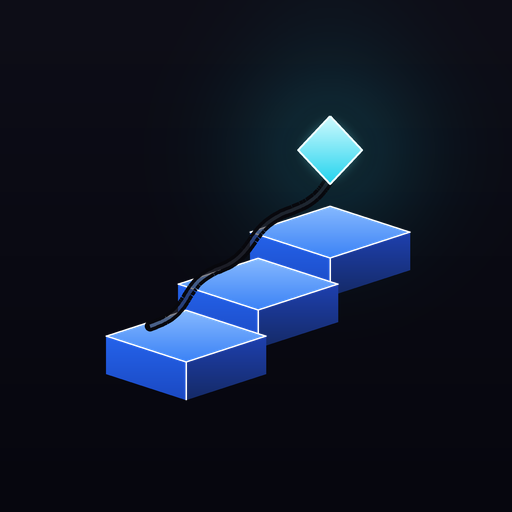

<p align="center"></p>

# MaglakbAI

> **Level up through proof, not promises.**
> Any skill. Any field. Any level.

MaglakbAI is a skill gamification app for anyone who wants to grow. You log real proof-of-work outputs — projects, scripts, books, certifications, diagrams, GitHub repos — to earn XP, unlock milestone achievements, and share your progress. XP comes from **building, not watching.**

**📱 Live app:** https://fascinating-kitten-b6a79d.netlify.app
**📖 User guide:** https://mromanil0310.github.io/app-maglakbai/USER_GUIDE.html

---

## Status

[](https://github.com/mromanil0310/app-maglakbai/actions/workflows/ci.yml)

🚀 **Live web / PWA pilot.** Runs in the browser and installs as a PWA. **Cloud backup** available via Settings → Cloud Backup (Magic Link sign-in — no password needed). Progress syncs across devices once signed in.

---

## Core idea — the addiction loop

```
Learn → Build → Log Output → Gain XP → Unlock Milestone → Share → Get Recognition → Repeat
```

The differentiator is **proof-based progression**: you don't earn XP for consuming content, you earn it for shipping real outputs.

## Features

- **4-step onboarding** — set your name, pick a career path, choose your experience level, and land on your dashboard
- **Career Evolution Map** — skill nodes that unlock as prerequisites complete (locked → available → in-progress → completed)
- **Custom roadmaps** — build your own path or fork any of the 19 built-in paths
- **Log outputs** — 9 types (project, certification, GitHub repo, book, script, design/diagram, reflection, event, other) with XP rewards
- **XP & leveling** — 10 levels with titles, skill-completion bonuses, achievements
- **Streak system** — grace period, freeze mechanic, and 7/14/30-day milestone bonuses
- **Milestone celebrations** — confetti, level-up cards, and a shareable post
- **Community feed** — emoji reactions and a leaderboard *(sample/preview data in the pilot — clearly labeled)*
- **Profile** — stats, achievements, and a proof-of-work gallery

### Built-in career paths (19)

| Path | Track |
|------|-------|
| 🏗️ **Data Architect** | SQL → Python → Snowflake → Data Modeling → AI Workflow Design |
| 🤖 **AI Engineer** | Python → REST APIs → Prompt Engineering → Vector DBs → RAG → AI Agents |
| 🌐 **Full Stack** | HTML/CSS → JavaScript → React/RN → Backend APIs → Databases → Cloud Deploy |
| … | + 16 more: Data Engineer, ML Engineer, Backend, Frontend, Cloud, DevOps, Cybersecurity, Product Manager, Business Analyst, Data Analyst, Project Manager, Solutions Architect, Software Architect, Mobile Developer, UI/UX Designer, Startup Founder |

## Tech stack

| Layer | Choice |
|---|---|
| Framework | React Native + Expo (SDK 55) |
| Web bundler | Vite (web) · Metro (native) |
| Navigation | React Navigation 7 |
| State | Zustand (single store) |
| Persistence | `localStorage` (device-local) + Supabase (optional cloud backup, Magic Link auth) |
| Analytics | PostHog-compatible, **opt-in** (no PII; no-ops unless configured) |

## Getting started

```bash
# install dependencies
npm install

# run the web app (fastest for UI work)
npx vite

# or run via Expo (all platforms)
npx expo start
```

## Privacy

- **Your data stays on your device** by default (browser `localStorage`). Optional **Cloud Backup** is available via Settings → Cloud Backup — sign in with a Magic Link (no password) to sync across devices via Supabase.
- **Analytics is opt-in.** Nothing is tracked until you consent, and no personal data (name, email, free text) is ever sent.
- **Export / Import** is built in so you can back up your progress and move it between browsers or devices.

## Roadmap

- **Phase 2 — Community + AI:** Live community feed (replace preview data with real Supabase queries), follow/unfollow, comments, real leaderboard, AI-generated LinkedIn posts on milestone completion
- **Phase 3 — Identity:** public profile URLs, GitHub links on outputs, LinkedIn share, push notifications
- **Phase 4 — Growth:** referrals, cohorts/teams, recruiter-facing profiles

## Project structure

```
App_MaglakbAI/
├── src/            # components, screens, navigation, store, types, utils
├── docs/           # PRD, ARCHITECTURE, DATABASE, USER_GUIDE.html
├── public/         # PWA manifest, icons, _redirects
└── App.tsx         # root component
```

---

_Built under the Biboy brand and developed against the Biboy Application Excellence Framework (BAEF)._
